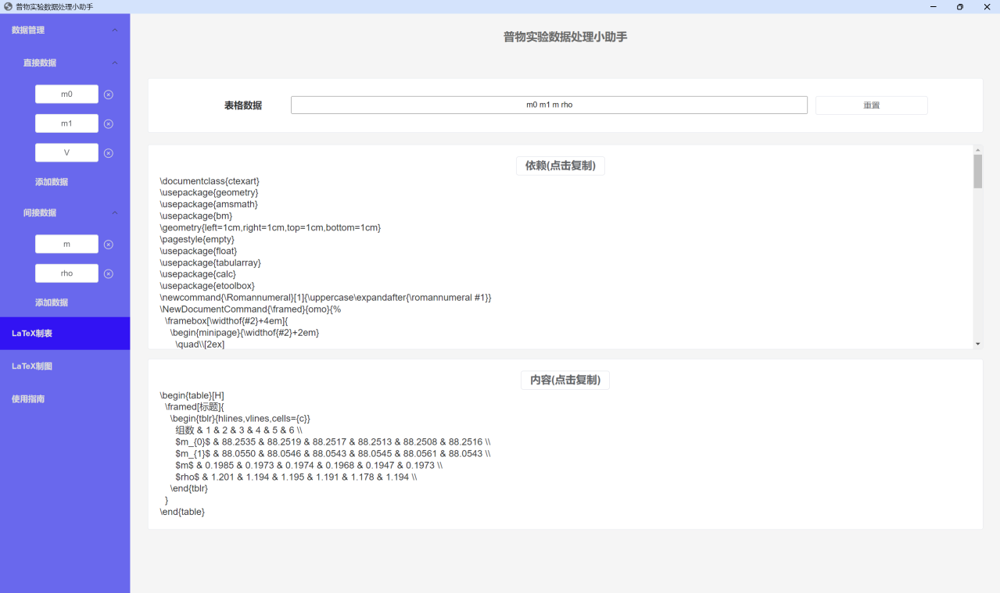

# 普物实验数据处理小助手

## 开发

本应用基于 vite+vue3+nw.js 开发。运行 npm run dev 构建开发环境， 运行 npm run build 构建生产环境。

## 下载

如果只需要使用，可以选择 Lab-Assistance.zip（解压即用）或 setup.exe（下载程序）。

## 功能

支持依照有效数字的保留规则自动计算各类实验参数。允许数据的遍历运算，可以自动合成不确定度。

可以自动生成制表和制图的LaTeX代码。目前在拟合方面支持常用的线性拟合和二次拟合。一键复制LaTeX代码后，使用xelatex构建命令编译。代码中的宏包依赖，texlive均有提供。

## 示例

### 直接数据

### 间接数据

### LaTeX制表

### LaTeX制图
