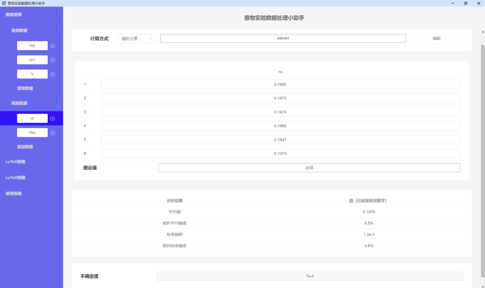
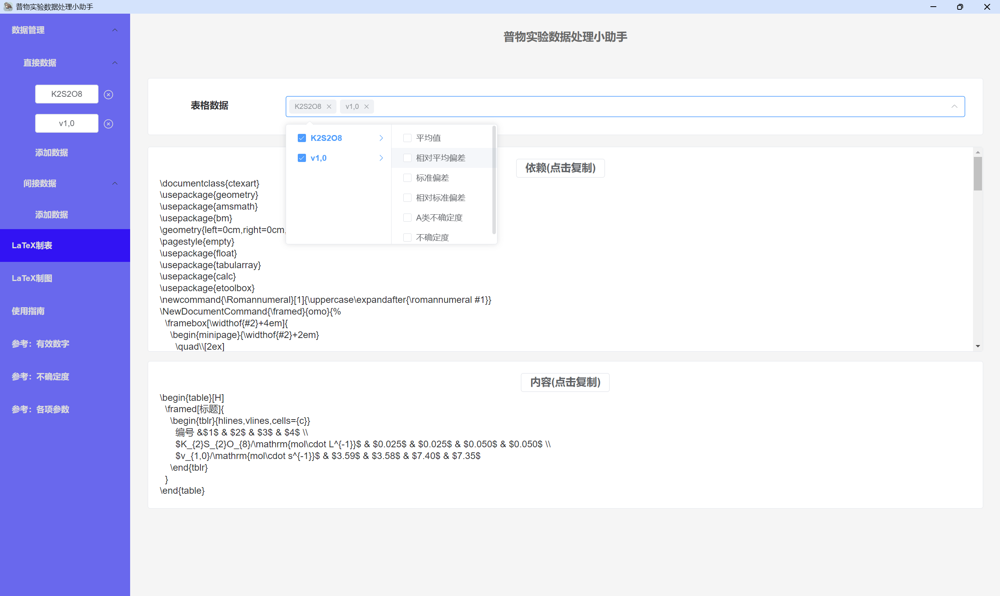
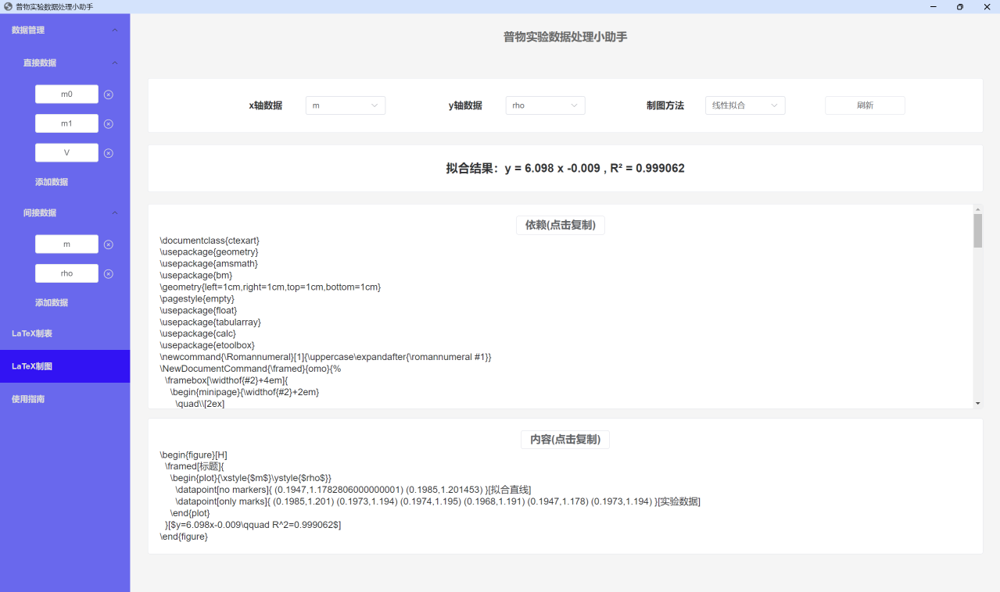
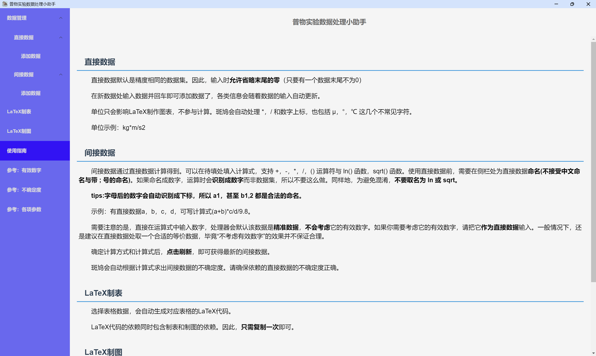
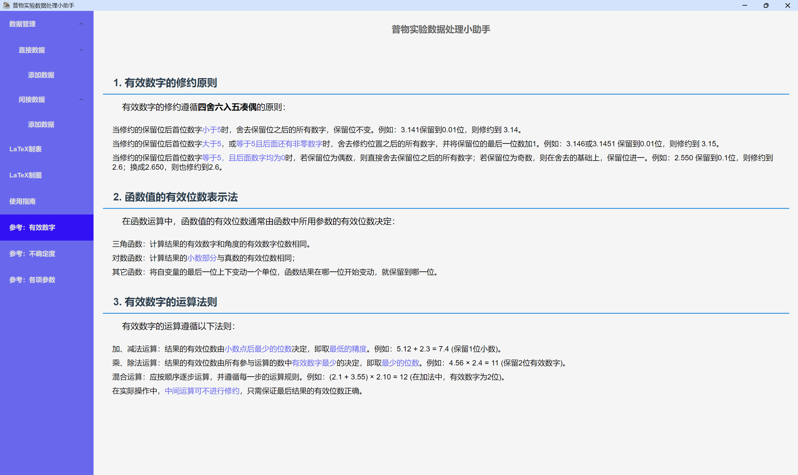

# 普物实验数据处理小助手
## 功能

支持依照有效数字的保留规则自动计算各类实验参数。允许数据的遍历运算，可以自动合成不确定度。

可以自动生成制表和制图的 LaTeX 代码。目前在拟合方面支持常用的线性拟合和二次拟合。一键复制 LaTeX 代码后，使用 xelatex 构建命令编译。代码中的宏包依赖，texlive 均有提供。

内部提供了基本的有关有效数字，不确定度和各种参数的相关资料。

## 开发

本应用基于 vite+vue3+nw.js 开发。
```bash
npm install
# 下载依赖
npm run dev
# 构建开发环境
npm run build
# 构建生产环境
node update.js
# 提交当前工作并创建tag
node release.js
# 提交release
```
## 下载与更新
Lab-Assistance 支持 windows-64 版本和 macOS-arm64 版本。

由于作者繁忙，为节省时间，在没有用户 issue 的情况下，更新不会提供 zip 和安装exe，仅提供 package.nw 和 app.nw，新用户可以下载 v1.0.6 的资源，再根据版本进行手动更新。

所有的资源都可以在页面右侧的 release 中找到。
### 下载
*  windows-64：setup.exe 为下载程序，用于首次安装的用户。若用户已有先前版本，可以选择更小的 updater.exe，并在原来安装的相同目录位置运行。win64.zip 为便携版，解压即用。
* macOS-arm64：arm64.zip 为便携版，解压即用。如果提示 Lab-Assistance 已损坏，在终端上运行命令 xattr -cr /path/to/Lab-Assistance.app。
### 更新
* windows :
    * 在一些较老旧的版本中，提供了 updater.exe， 在原来目录下运行即可完成更新。
    * 较新版本使用下载 package.nw 包，并替换 Lab-Assistance 目录下的package.nw 包的方式更新。
* macOS:
    * 下载app.nw包，并替换/Lab-Assistance.app/Contents/Resources目录下的app.nw包。

**不推荐任何用户使用老旧版本！一些老版本存在数据计算错误的原则问题，且一般而言，老版本 bug 更多！**

## LaTeX 相关

提供了 lab-assistance.sty 作为可以引用的宏包。

如果使用 texstudio 作为编辑器，这里还提供了 lab-assistance.cwl 作为可用的竣工文件。
## 示例

### 直接数据


### 间接数据



### LaTeX制表


### LaTeX制图


### 使用说明


### 内部参考
