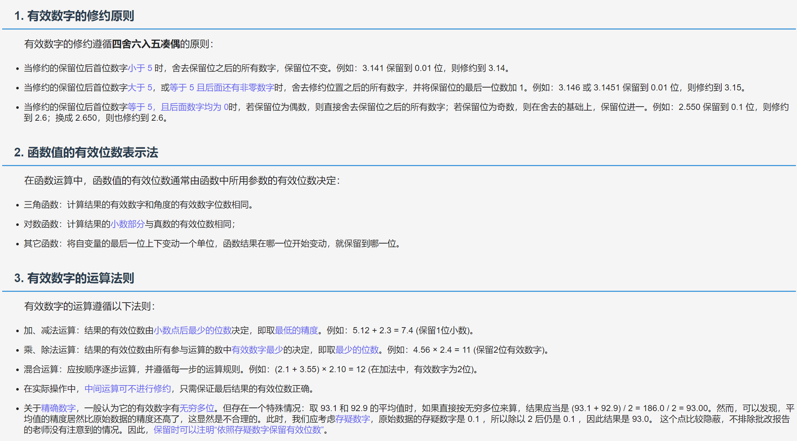
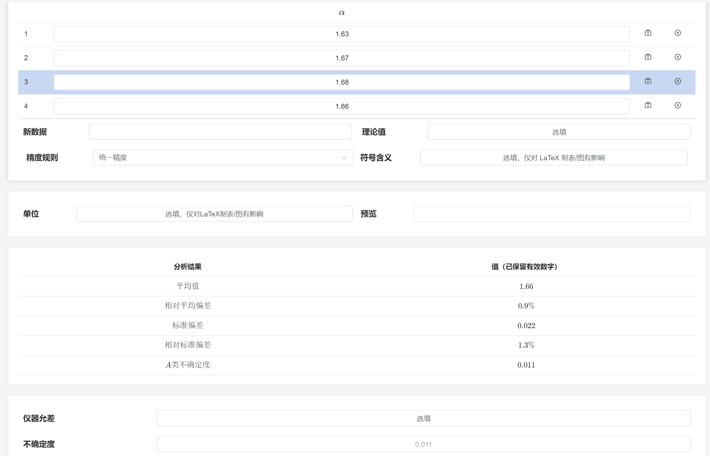
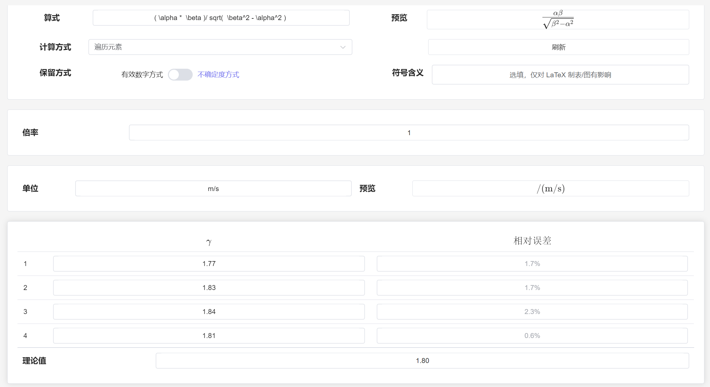
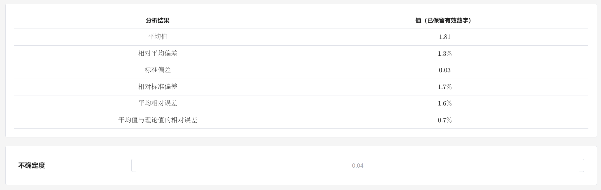
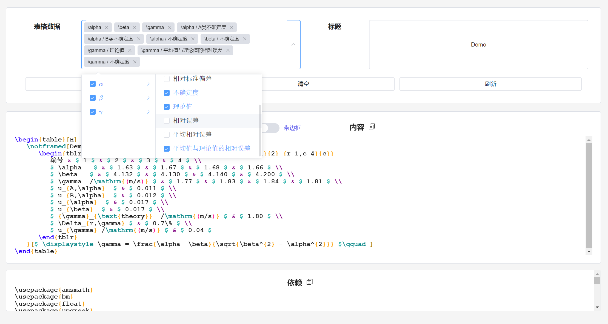
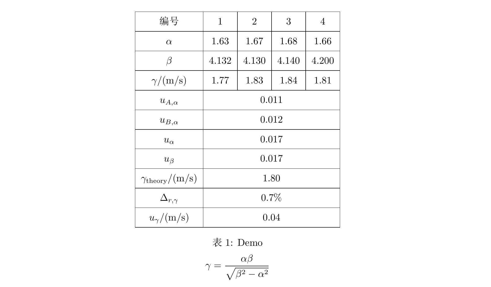
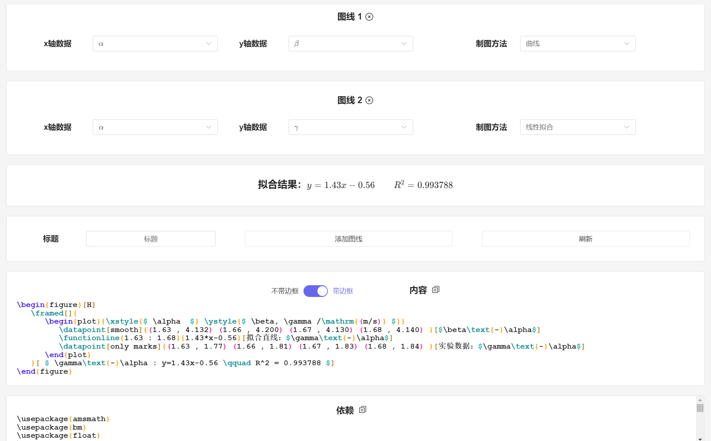
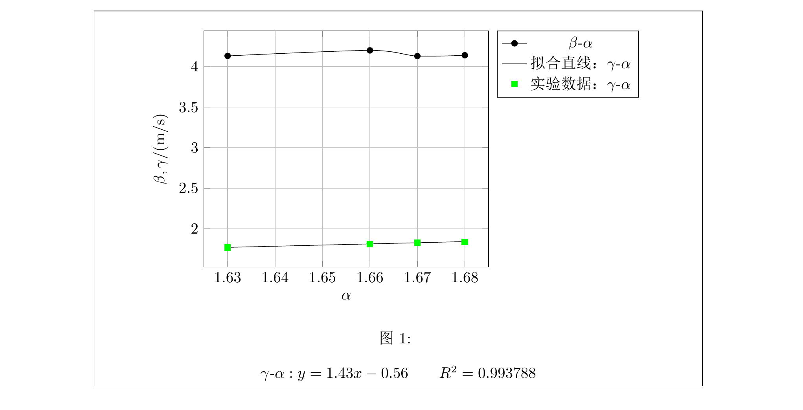

# 欢迎使用 Lab-Assistance

* 还在因为搞不清楚有效数字而烦恼吗？
* 还在疲于计算各种统计量吗？
* 还在为了图表设计而头疼吗？

如果你是一名 LaTeX 用户，那么 Lab-Assistance 将会是一个很好的选择！

# 功能预览

Lab-Assistance 中的所有数据都遵循着有效数字的运算规则。

作为不使用 LaTeX 的用户，您关注的可能是这些功能：

## 有效数字、不确定度、各项统计量的参考文档

## 自动计算统计量

## 间接数据的批量计算

## 不确定度的自动推断

而作为 LaTeX 用户，Lab-Assistance 还提供如下的实用功能：

## 生成表格代码

编译结果：

## 生成绘图代码

编译结果：

Lab-Assistance 内部提供了详细的功能说明。更多的功能，就请各位自己探索了。
